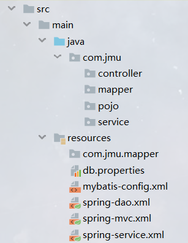

#SSM使用
##1. 文件结构的介绍
* ####src文件夹  
    *   
    1) **controller**包写的就是视图层的代码，即Servlet代码，调用service层然后给前端放回页面。
    2) **service**包就是写业务逻辑层的代码。 
    3) **mapper**包就是dao，只是在SSM框架中，我们习惯把dao称作mapper。
    4) **pojo**包就是entities包（放实体类的包），只是在SSM框架中，习惯把entities包叫作pojo。
* ####target和out文件夹
    1) 这两个是项目运行的时候自动生成的，target是maven生成的，out项目输出文件夹，运行的时候要以out文件夹中文件的结构为准。
* ####web文件夹
    1) 存放html、css、js、images等的文件。

##2. mapper/dao层代码的写法 
* ####准备示例
    * 以实体类User为例，对应数据库的user表：user(account, password)  
```java
public class User{
    private String account;
    private String password;
    //getter和setter太长了，我就省略了，但是实际是要写的。
}
```
   * 关于实体类字段的命名
      * 实体类的字段名称要和数据库表中的属性名称一致。      
      * 如果数据库中表属性的名称是a_b的形式，则实体类字段名称对应的可以为aB。例如：数据库表中有属性user_name，则实体类字段名可以为userName，也可以为user_name。
   
* ####怎么写mapper/dao层代码
    * dao层的代码写在mapper包中，我们只写接口，不写实现类。命名方式统一都是xxxMapper.java，这么命名是一种规范。
    ```java
  public interface  UserMapper{
      //1、查询所有user
      public List<User> queryAll();
      //2、通过账号查询user
      public User queryByAcc(String account);
      //3、通过账号和密码查询user
      public User queryByAccPwd(@Param("acc") String account,@Param("pwd") String password);
      //4、添加一个user
      public int addUser(User user);
  }
    ```
  > * 关于返回结果：如果查询的结果有多条记录，我们统一返回一个List；如果查询结果只有一条记录，我们就返回一个实体类对象；对于增删改操作的方法，统一返回的都是int类型。
  > * 关于方法的参数：如果方法只有一个参数，我们不用做特殊处理；如果方法有多个参数，我们需要在参数前面添加@Param注解，给参数起个别名，在后面写sql的时候会用到。
* ####写sql
    * 在接口的方法上面添加注解即可
    ```java
  import org.apache.ibatis.annotations.Insert;
  import org.apache.ibatis.annotations.Select;
  public interface  UserMapper{
          //1、查询所有user
          @Select("select * from user")
          public List<User> queryAll();
          
          //2、通过账号查询user
          @Select("select * from user where account=#{account}")
          public User queryByAcc(String account);
          
          //3、通过账号和密码查询user
          @Select("select * from user where account=#{acc} and password=#{pwd}")
          public User queryByAccPwd(@Param("acc") String account,@Param("pwd") String password);
  
          //4、添加一个user
          @Insert("insert into user values(#{account},#{password})")
          public int addUser(User user);
    }
    ```
  > * @Select：该注解用来写select语句。
  > * @Update: 该注解用来写update语句。
  > * @Delete：该注解用来写delete语句。
  > * @Insert: 该注解用来写insert语句。
  > * 关于sql语句中的#{} ：这个和preparedStatement编译的sql中的?是一样的效果。
  > * 这个#{}要怎么写：  
      方法参数只有一个的情况：参数只有一个又分成两个情况，第一种参数类型是实体类（addUser(User user)方法），这种情况#{}中填的就是User实体类的字段名，如：insert into user values(#{account},#{password})  
      第二种参数类型是包装类，包装类就是像String、Integer、Double这样的类，这种情况#{}中直接写参数的名字（queryByAcc(String account)方法），如：select * from user where account=#{account}。  
      方法参数是多个的情况：如果方法参数是多个，一般只有一种情况，就是多个参数都是包装类，这种情况mybatis无法识别参数的名字，因此我们要在参数前面添加@Param注解，给参数起个别名，然后#{}中写的是我们起的别名。就像上面的queryByAccPwd方法。
* ####结束
##2. service层代码的写法
* service层代码要写接口和实现类。接口写在service包下，实现类写在impl包下。
* 示例：UserServiceImpl.java
```java
@Serive
public class UserServiceImpl implements UserService{
    @Autowired
    private UserMapper userMapper;
    //setter方法必须写
    public void setUserMapper(UserMapper userMapper){
        this.userMapper=userMapper;
    }
    //省略业务逻辑方法
}
```
> * service层代码没有什么特殊，就是调用dao层的方法，然后处理业务逻辑。  
> * 但是要注意的是，我们要像上面示例，在类上面添加@Service注解，在私有成员变量上面添加@AutoWired注解（每个成员变量都要加），添加setter方法，并且成员变量的命名是要类名首字母小写，例如：我有UserMapper接口，我在service命名成员变量的时候就命名为userMapper。
* ####结束
##3. controller层代码的写法
* ####controller层就是servlet所在的那一层，负责接收请求，然后调用service层方法。
* 示例代码
```java
@Controller
@RequestParam("/user")
public class UserController{
    @Autowired
    private UserService userService;
    
    //1、发送/user/login请求，跳转到登录页面
    @RequestParam("/login")
    public String toLogin(){
        /*返回的字符串是.html文件的名字，不用带.html后缀，我们这里
            给前端返回loginPage.html页面，默认根路径是web文件夹。
        */
        return "loginPage";
    }
    
    //2、发送/user/registry请求，用户注册
    @RequestParam("/registry")
    @ResponseBody
    public String registry(User user){
        /*前端的表单的name属性，必须设置为和User类的字段名相同
            如<input name="account"/>，上传的时候SpringMVC框
            架会自动封装成User对象。所以name属性必须一致，它才会封装
        */
        //这里因为添加了@ResponseBody注解，所以返回的是字符串数据
        return "success";
    }
    
    //3、发送/user/show请求，现实用户账号
    @RequestParam("/show")
    @ResponseBody
    public String show(){
        User user=userService.queryByAcc("admin");
        //JSON解析工具ObjectMapper，将User类转成JSON字符串，以下代码正常应该写在service层，写法固定。
        ObjectMapper objectMapper=new ObjectMapper();
        try {
            return objectMapper.writeValueAsString(user);
        }catch (JsonProcessingException e){
            e.printStackTrace();
            return null;
        }
    }
    
    //setter方法必须写
    public void setUserService(UserService userSerivce){
        this.userService=userSerivce;
    }
}
```
* 解释说明
    * 必须做的事：
      1) 类上必须加@Controller注解。
      2) 成员变量上必须添加@AutoWired注解，且必须添加成员变量的setter方法。成员变量类型为service的接口类型，同时命名是要类名首字母小写。例如：我有个UserService接口，我UserController的成员变量类型是要UserService，且命名为userService。
      
    * @RequestParam
      1) 该注解用来给方法或类添加请求。
      2) 如上面我在类上和方法上都添加了@RequestParam注解，因此我前端访问toLogin()方法的时候发的请求就是/user/login。
      3) 如果我把类上的@RequestParam("/user")注解去掉，访问toLogin()方法发的请求就是/login。但是一般不建议这样，什么功能我们就在类上添加对应的请求，如关于老师的功能，我们就在类上添加@RequestParam("/teacher")，这样我们请求关于老师的方法的时候，都要在前面添加/teacher请求，比较明确。
      4) 只添加@RequestParam注解，方法返回字符串，默认返回的是一个.html文件，如：return "pages/login"，返回的就是web目录下的pages文件夹中的login.html。
    * @ResponseBody
      1) 上面只添加@RequestParam注解，返回字符串默认返回的是一个html页面，如果我们要返回一个字符串数据，就再添加一个@ResponseBody注解，它告诉SpringMVC框架，方法要返回的是数据而不是页面。
    * 对上面registry(User user)方法的解释
      1) 如果我们要做注册功能，就要收集表单的数据。<input>标签的name属性值必须设置为和User类的字段名一样，这样SpringMVC就会自动识别，封装的时候自动将其封装成User对象，并传给registry方法。
  * ####结束
